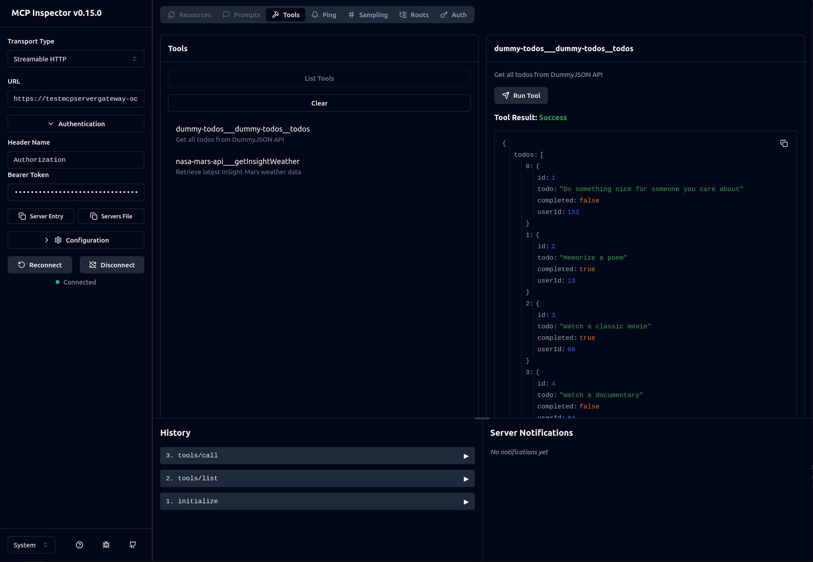

## Sample requests

## Create Gateways

### Gateway with no Auth
```bash
curl -X 'POST' \
  'http://localhost:8000/gateways/no-auth' \
  -H 'accept: application/json' \
  -H 'Content-Type: application/json' \
  -d '{
  "gateway_name": "SampleGatewaySecond",
  "description": "A sample AgentCore Gateway with no auth"
}'
```

Response
``` json
{
  "status": "success",
  "gateway_id": "samplegatewaysecond-abc123def4",
  "gateway_url": "https://samplegatewaysecond-abc123def4.gateway.bedrock-agentcore.us-east-1.amazonaws.com/mcp",
  "gateway_name": "SampleGatewaySecond",
  "message": "Gateway 'SampleGatewaySecond' successfully created without authentication"
}
```


### Gateway with Cognito Auth
```bash
curl -X 'POST' \
  'http://localhost:8000/gateways' \
  -H 'accept: application/json' \
  -H 'Content-Type: application/json' \
  -d '{
  "gateway_name": "TestMCPServerGateway",
  "description": "A test sample gateway",
  "auth_config": {
    "user_pool_id": "us-east-1_aaaaa",
    "client_id": "abcdefghijklmnopqrstuvwxyz",
    "discovery_url": "https://cognito-idp.us-east-1.amazonaws.com/us-east-1_aaaaa/.well-known/openid-configuration"
  }
}'
```

Response
``` json
{
  "status": "success",
  "gateway_id": "mycreated-gateway-id123",
  "gateway_url": "https://mycreated-gateway-id123.gateway.bedrock-agentcore.us-east-1.amazonaws.com/mcp",
  "gateway_name": "TestMCPServerGateway",
  "message": "Gateway 'TestMCPServerGateway' successfully created"
}
```

### Create Tool from OpenAPI Spec URL
```bash
curl -X 'POST' \
  'http://localhost:8000/tools/from-url' \
  -H 'accept: application/json' \
  -H 'Content-Type: application/json' \
  -d '{
  "gateway_id": "testmcpservergateway-ocunydee97",
  "tool_name": "nasa-mars-api",
  "openapi_spec_url": "https://raw.githubusercontent.com/awslabs/amazon-bedrock-agentcore-samples/refs/heads/main/01-tutorials/02-AgentCore-gateway/02-transform-apis-into-mcp-tools/01-transform-openapi-into-mcp-tools/openapi-specs/nasa_mars_insights_openapi.json",
  "auth": {
    "type": "api_key",
    "provider_name": "NasaInsightsAPIKey",
    "config": {
      "api_key": "my-nasa-api-key",
      "api_key_param_name": "api_key",
      "api_key_location": "QUERY_PARAMETER"
    }
  }
}'
```

Response
```json
{
  "status": "success",
  "tool_name": "nasa-mars-api",
  "gateway_id": "mycreated-gateway-id123",
  "openapi_spec_path": "openapi_specs/nasa-mars-api_openapi.json",
  "message": "Tool 'nasa-mars-api' successfully created and registered on gateway mycreated-gateway-id123"
}
```

### Create Tool from API Info
```bash
curl --location 'http://localhost:8000/tools/from-api-info' \
--header 'accept: application/json' \
--header 'Content-Type: application/json' \
--data '{
  "gateway_id": "mycreated-gateway-id123",
  "tool_name": "dummy-todos",
  "api_info": {
    "method": "GET",
    "url": "https://dummyjson.com/todos",
    "description": "Get all todos from DummyJSON API"
  }
}'
```

Response
```json
{
    "status": "success",
    "tool_name": "dummy-todos",
    "gateway_id": "mycreated-gateway-id123",
    "openapi_spec_path": "openapi_specs/dummy-todos_openapi.json",
    "message": "Tool 'dummy-todos' successfully created and registered on gateway mycreated-gateway-id123"
}
```





### Create Tool from OpenAPI Spec File Upload
// TODO


## Permissions needed (For scenario where api key was used)

**Role:** `sample-lambdagateway-role-demo`  
**Policy:** `sample-lambdagateway-role-demo-inline-policy`

| Action | Purpose |
|--------|---------|
| `bedrock-agentcore-control:*` | Manage gateways and targets |
| `bedrock-agentcore:GetWorkloadAccessToken` | Get workload identity token |
| `bedrock-agentcore:InvokeCredentialProvider` | Invoke the credential provider |
| `bedrock-agentcore:GetResourceApiKey` | Retrieve API key from Token Vault |
| `secretsmanager:GetSecretValue` | Read secrets from Secrets Manager |
| `s3:GetObject` | Read OpenAPI specs from S3 |
| `s3:PutObject` | Upload OpenAPI specs to S3 |
| `s3:ListBucket` | List S3 bucket contents |
| `iam:PassRole` | Pass IAM role to services |
| `cognito-idp:*` | Cognito user pool operations |
| `sts:GetCallerIdentity` | Get AWS caller identity |

**Resource:** `*` (should be scoped down for production)

